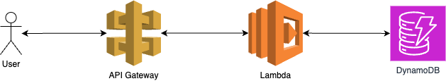

cc-test
=======

A simple REST API built with AWS SAM, consisting of a single AWS Lambda behind an API Gateway which stores the records in DynamoDB table. New changes are deployed automatically to the `dev` env on push to the `main` branch, via a simple GitHub workflow.

Architecture diagram:


Capabilities
------------

[x] Simple CRUD REST API
[x] A deployment pipeline
[x] IAM roles used
[x] Lambda have a minimum required set of permissions (I've used a single lambda, a split could help here)
[x] Visual diagram created
[x] Resource names defined in env variables (example: `USERS_TABLE_NAME`)
[x] Input validation (using `yup`)
[x] Typescript used

Extras:
[x] Unit test coverage


API doc (examples)
------------------

The API exposes 4 simple endpoints:
```
/users [GET, POST]
/users/{id} [DELETE, PATCH]
```

TODO: Create a swagger documentation.

### Examples

Replace `{url}` with an API endpoint, and `{id}` with UUID of a given user.

Create a new user:
```
curl -X POST -H "Content-Type: application/json" -d "{\"name\":\"BradyMoss\",\"email\":\"brady@moss.com\"}" {url}/users
```

Get a list of users:
```
curl -X GET {url}/users
```

Edit a given user:
```
curl -X PATCH -H "Content-Type: application/json" -d "{\"name\":\"BradyMossEdited\",\"email\":\"brady@moss.com\"}" {url}/users/{id}
```

Delete a given user:
```
curl -X DELETE {url}/users/{id}
```

Example commands
----------------

Installing dependencies locally: `cd users && npm install`
Running unit tests: `cd users && npm run test`
